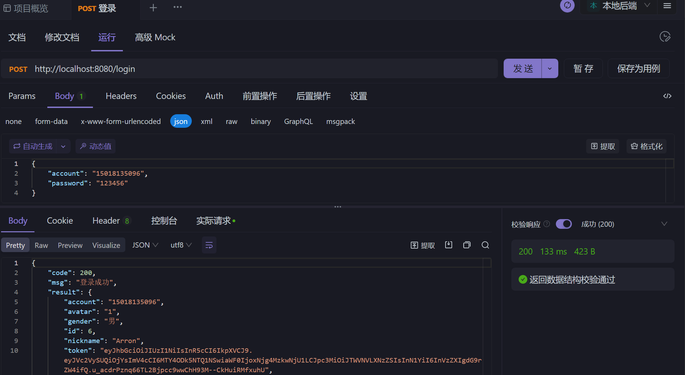
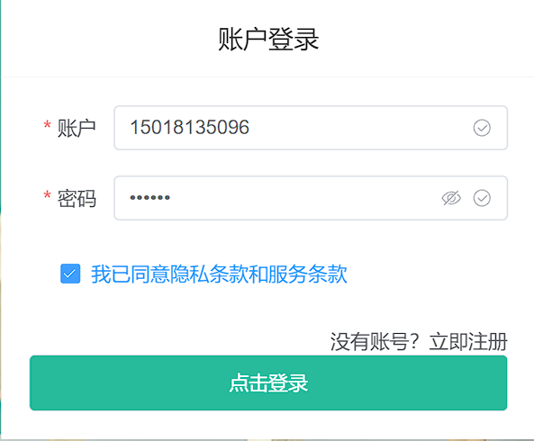
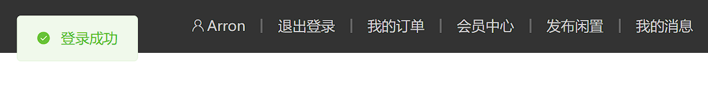
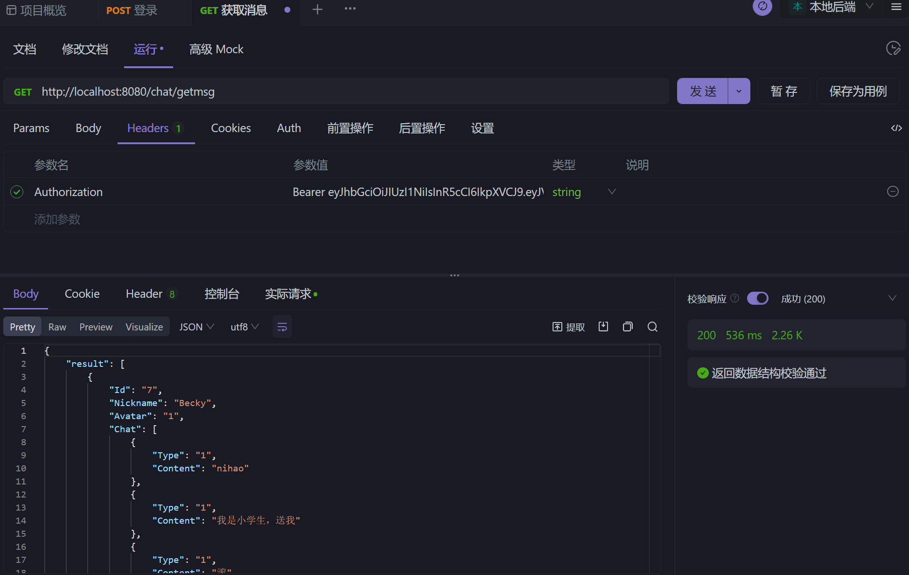
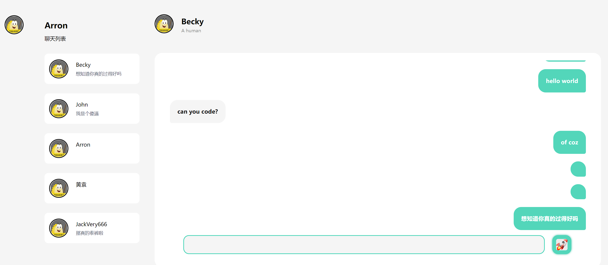

# 《软件工程实训（中级）》——海鲜市场

## 团队介绍

### 组长

叶梓荣

### 组员

叶文熙、张隽滔、苏东鹏、黄裔杰、郑泓东

### 分工

#### 前端开发

- 郑泓东
  
  - 布局（Layout）
  
  - 首页（Home）
  
  - 分类页（Category）
  
  - 结算页（Checkout）
  
  - 支付页（Pay）
  
  - 聊天室（Chat）
  
  - 发布闲置页（Release）

- 张隽滔

  - 购物车(CartList)

  - 商品详情页(Detail)

#### 后端开发

- 黄裔杰
  
  - 网站首页的接口（返回全部商品、分类下属商品、最近发布、轮播图）
  
  - 发布闲置接口（将新发布的闲置商品添加到数据库）
  
  - 订单相关接口（从用户购物车获取商品信息，生成用户所提交的订单，添加到数据库，并能从数据库获取订单）

- 郑泓东
  
  - 数据库连接
  
  - CORS（跨域资源共享）中间件、Recovery中间件
  
  - 图片（上传、加载、删除）
  
  - 聊天（获取聊天列表、添加聊天对象、发送聊天消息）
- 叶文熙
  - 登录/注册接口（登录、注册、对密码加密，发放Token，验证手机号是否被注册）
  - 中间件接口（AuthMiddleware)
  - 修改头像接口
  - 修改密码接口
  - 商品推荐接口
  - 修改个人信息接口
  - 添加/删除地址接口


- 苏东鹏

  - 获取商品详情
  
  - 购物车相关接口（维护购物车记录并提供查询）

  - 有关闲置查询接口（查询发布、卖出、买到闲置列表接口）

## 项目介绍

### 项目背景介绍

目前校内二手物品交易信息主要通过“校园集市”进行发布，但在实际使用过程中，这存在一些不足之处。例如，“校园集市”板块较多，仅有“二手闲置”一个大板块用于发布交易信息，没有细分物品种类。而且“校园集市”发布的帖子都是统一文字加图片的格式，价格信息不明显，图片是小图难以看出物品细节。另外，想要和卖家谈论只能在帖子的评论区留言，与商家私聊只能通过其提供的联系方式，用微信qq等另外的聊天工具进行沟通，较为麻烦。除此之外，每到毕业季和开学季，就会有许多二手交易需求，因此，开发一个专门用于校内二手物品交易的网站还是很有必要的。

### 项目功能介绍

暂无

### 项目实现过程中遇到的问题及解决办法

- 中间件

  该中间件用于解决身份验证的问题。在Web应用程序中，有些路由或功能可能需要用户进行身份验证才能访问。该中间件可以确保只有具有有效身份验证令牌的用户才能通过身份验证，并且只有经过身份验证的用户才能继续访问受保护的路由或功能。

  具体来说，该中间件执行以下操作：

  1. 验证令牌格式：它检查请求中的令牌是否具有正确的格式（以 "Bearer " 前缀开头）。
  2. 验证令牌有效性：它解析和验证令牌，确保令牌是有效的、未过期的，并且具有正确的签名。
  3. 验证用户存在性：它从令牌中提取用户ID，并在数据库中查找对应的用户，确保用户存在。
  4. 设置用户信息：如果所有的验证步骤都通过了，它将用户对象设置到请求的上下文中，以便后续的处理函数可以使用用户信息进行进一步的操作。

  通过使用该中间件，开发人员可以轻松地将身份验证逻辑应用于需要保护的路由或功能，确保只有经过身份验证的用户才能访问这些资源。这有助于增强应用程序的安全性，并防止未经授权的访问。

  ```go
  func AuthMiddleware() gin.HandlerFunc {
  	return func(ctx *gin.Context) {
  		//获取anthorization header
  		tokenString := ctx.GetHeader("Authorization")
  		//验证token格式
  		if tokenString == "" || !strings.HasPrefix(tokenString, "Bearer ") {
  			ctx.JSON(http.StatusUnauthorized, gin.H{
  				"code": 401,
  				"msg":  "权限不足",
  			})
  			ctx.Abort()
  			return
  		}
  
  		tokenString = tokenString[7:]
  
  		token, claims, err := common.ParseToken(tokenString)
  		if err != nil || !token.Valid {
  			ctx.JSON(http.StatusUnauthorized, gin.H{"code": 401, "msg": "权限不足"})
  			ctx.Abort()
  			return
  		}
  
  		//验证通过后获取claim中的userid
  		userid := claims.UserID
  
  		DB := common.GetDB()
  		var user model.User
  		DB.First(&user, userid)
  
  		//用户不存在
  		if user.ID == 0 {
  			ctx.JSON(http.StatusUnauthorized, gin.H{"code": 401, "msg": "权限不足"})
  			ctx.Abort()
  			return
  		}
  
  		//用户存在 将user的信息写入上下文
  		ctx.Set("user", user)
  
  		ctx.Next()
  	}
  }
  ```

  

- 上传图片
  
  ```go
  func HandleUpload(c *gin.Context) {
      db := common.GetDB()
  
      // 使用c.MultipartForm()从上下文中检索多部分表单数据
      form, err := c.MultipartForm()
      if err != nil {
          c.AbortWithStatusJSON(http.StatusBadRequest, gin.H{"error": err.Error()})
          return
      }
  
      // 初始化一个空的图像ID切片，以跟踪成功上传的图像的ID
      var imageIds []uint
  
      // 循环遍历多部分表单数据中的所有文件头
      for _, fileHeaders := range form.File {
          for _, fileHeader := range fileHeaders {
              // 对于每个文件头，使用fileHeader.Open()打开文件
              file, err := fileHeader.Open()
              if err != nil {
                  log.Println("Error opening uploaded file:", err)
                  continue
              }
              defer file.Close()
              // 使用ioutil.ReadAll()读取文件内容
              blob, err := ioutil.ReadAll(file)
              if err != nil {
                  log.Println("Error reading uploaded file:", err)
                  continue
              }
  
              // 创建一个新的model.Image结构体，将文件内容存储在Blob字段中
              dbImage := model.Image{Blob: blob}
              err = db.Create(&dbImage).Error
              if err != nil {
                  log.Println("Error creating image record:", err)
                  continue
              }
  
              // 将成功上传的图像ID添加到imageIds切片中
              imageIds = append(imageIds, dbImage.ID)
          }
      }
      c.JSON(http.StatusOK, gin.H{"imageIds": imageIds})
  }
  ```

- 加载图片
  
  ```go
  func HandleImage(c *gin.Context) {
      db := common.GetDB()
  
      // 从上下文中获取查询参数"id"
      id := c.Query("id")
  
      // 声明一个model.Image变量image，用于存储从数据库中检索到的图像
      var image model.Image
  
      // 使用db.First()从数据库中检索具有指定ID的图像记录
      err := db.First(&image, id).Error
  
      // 如果检索过程中出现错误，使用c.AbortWithStatusJSON()返回一个JSON响应，指示无法找到图像
      if err != nil {
          c.AbortWithStatusJSON(http.StatusNotFound, gin.H{"error": "Image not found"})
          return
      }
  
      // 如果成功检索到图像记录，使用c.Data()将图像数据以HTTP响应的形式返回给客户端。此处假设所有图像均为JPEG格式的二进制数据，因此将MIME类型设置为"image/jpeg"
      c.Data(http.StatusOK, "image/jpeg", image.Blob)
  }
  ```

### 项目代码介绍

暂无

### 部分测试报告展示

- 登录
  
  
  
  
  
  

- 获取聊天列表
  
  
  
  
